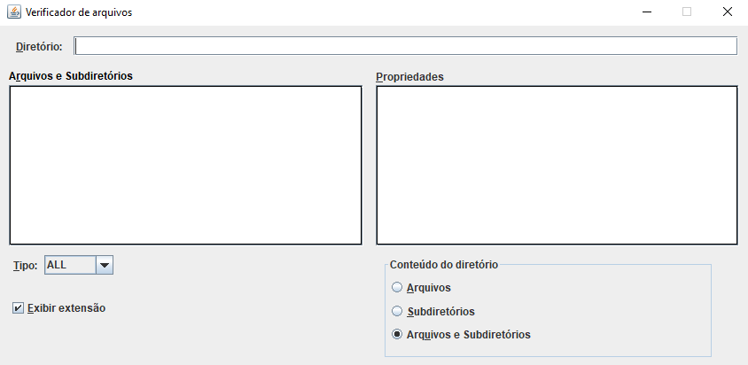

# FileNavigator (Verificador de Arquivos)

O **Verificador de Arquivos** é uma aplicação Java que permite aos usuários navegar por arquivos e subdiretórios dentro de um diretório especificado, fornecendo uma interface gráfica intuitiva para visualizar e filtrar os conteúdos de um diretório.

## Funcionalidades

- **Navegação de Diretórios**: Permite a navegação através de arquivos e subdiretórios dentro de um diretório especificado.
- **Filtragem por Extensão**: Os usuários podem filtrar os arquivos exibidos por diferentes extensões (ex: .txt, .pdf, .jpg, etc.).
- **Exibição de Propriedades**: Exibe propriedades detalhadas de arquivos e subdiretórios selecionados, incluindo caminho absoluto, nome, última modificação e tamanho em bytes.
- **Opções de Exibição**: Permite aos usuários escolherem entre exibir somente arquivos, somente subdiretórios ou ambos.

## Requisitos

- Java 8 ou superior

## Como Executar

1. Clone o repositório:
    ```sh
    git clone https://github.com/usuario/FileNavigator.git
    ```
2. Compile o projeto:
    ```sh
    javac -d bin -sourcepath src src/app/FileNavigator.java
    ```
3. Execute o projeto:
    ```sh
    java -cp bin app.FileNavigator
    ```

## Estrutura do Projeto

```plaintext
verificador-de-arquivos/
│
├── src/
│   ├── app/
│   │   └── FileNavigator.java
│   │   └── gui/UI.java
│   ├── model/
│   │   └── FileChecker.java
│   │   └── FileCheckerException.java
│   └── util/
│       └── Constants.java
│       └── Extension.java
│       └── InputOutput.java
│       └── OptionRadioButton.java
│
└── README.md

```

## Tela inicial



## Licença / Autor

[](https://github.com/michelleGomes85/FileNavigator/blob/main/LICENSE) 
[](https://github.com/michellegomes85)
